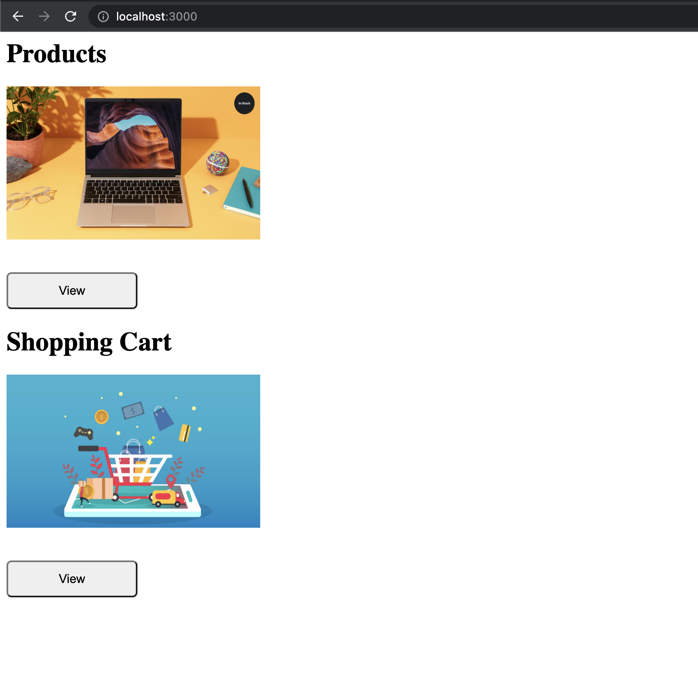
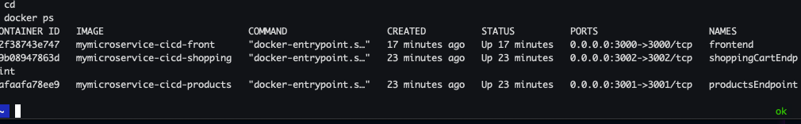

### CHALLENGE FINAL Bootcamp DevOps

La empresa ZERO Technology, solicita al Equipo de DevOps Trainer, la contenerizacion de su aplicacion "Products DevOps" en la que incluye:

- Frontend
- Backend: products & shopping-cart

#### Frontend
Aplicacion realizada en express y se expone en el puerto 3000

### Backend products
Aplicacion realizada en express y se expone en el puerto 3001

### Backend shopping-cart
Aplicacion realizada en express y se expone en el puerto 3002


#### Build Docker 
- Para construir ejecutamos lo siguiente:
```
    docker build -t ms-frontend:1.0 frontend
    docker build -t ms-products:1.0 products
    docker build -t ms-shopping-cart:1.0 shopping-cart
```
#### Prueba Local
    cd micro-service-name 
    npm install
    npm run
    

#### Iniciar los contenedores 
    docker run -d -p 3000:3000 \
    -e PRODUCTS_SERVICE=host.docker.internal \
    -e SHOPPING_CART_SERVICE=host.docker.internal \
    ms-frontend:1.0

    docker run -d -p 3001:3001 ms-products:1.0
    docker run -d -p 3002:3002 ms-shopping-cart:1.0

### Arquitectura

## Entrega

### Aplicación:
- Diseño de Diagrama de la aplicacion
- Crear Repositorio Github para el Codigo
- Crear las ramas (develop, Testing, Master) en el Repositorio
- usar node >= 16

### Contenerizacion de la aplicacion
- Construir la aplicacion y subirla a docker-hub

### CICD Tools
- Usar Github Actions, Jenkins ó Gitlab para el despliegue automatico de la aplicación

### Despliegue
- Despliegue en EC2 ó EKS 
### Despliegues en Kubernetes
- Crear los manifiestos de kubernetes
- Configuracion de ingress para nginx/alb-ingress-controller
- Desplegarlos en Killercoda/AWS-EKS 

### Adicional 
- Crear Documentación
- Buenas practicas

## Resultado




# product-devops
